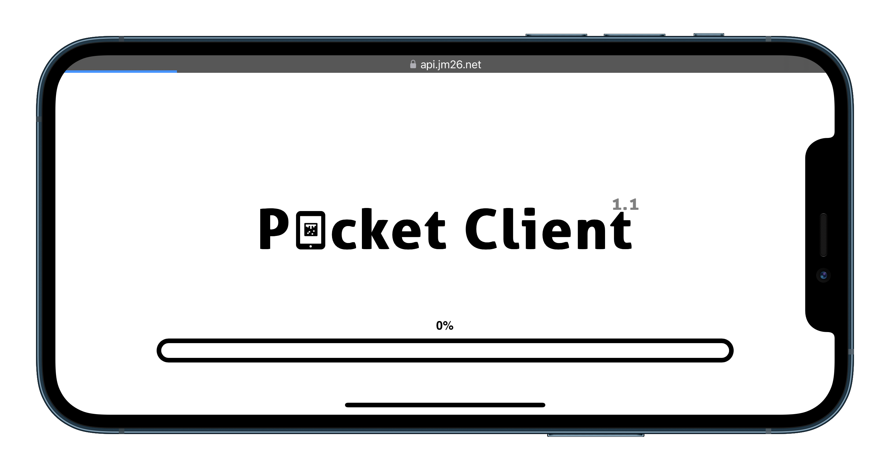
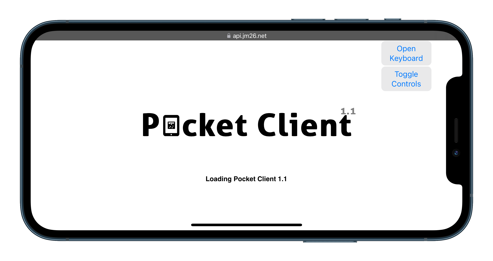
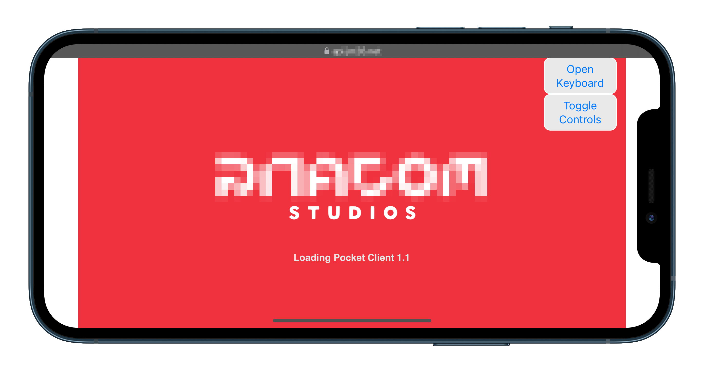

# Pocket Client

## OFFICIALLY BROKEN BY @wxnnvs

An eaglercraft 1.8 mobile client forked from resent client.

## Table of Contents

- [Pocket Client](#pocket-client)
  - [Table of Contents](#table-of-contents)
- [IMPORTANT](#important)
  - [Goals](#goals)
  - [Progress](#progress)
  - [Some screenshots (real screenshots)](#some-screenshots-real-screenshots)
  - [Credits](#credits)
  - [License](#license)

# IMPORTANT

HELP NEEDED! I need help to deobfuscate the resent script. Because of this further development is paused. If someone could help please open an pull request or contact me on discord. 

This repository does not contain any code or resources from Minecraft / eaglercraft. This project is under development and is not ready for use. Please do not ask for support in the issues section of this repository. If you have any questions, please join the [Not Existent Discord](#pocket-client) or contact me via Discord DM: `Cufiy`.

Support this project by giving it a STAR. By doing this you will also stay updated when new releases are published!

## Goals

- Should be able to run on mobile (Android and iOS)
- Responsive UI
- Should be able to run on low-end devices (optional)
- UI just like Minecraft Pocket Edition

## Progress

- [x] Make it work on mobile
- [ ] Bug fixes
- [x] Add custom branding
- [ ] Bug fixes
- [ ] Optimize the code
- [ ] Make it more user friendly
- [ ] Change the UI
- [ ] Bug fixes
- [ ] Make it ready for use
- [ ] Publish it

Current progress: 20% (==--------)

## Some screenshots (real screenshots)

(In-Game screenshots coming soon)
## Credits

- Eaglercraft by lax1dude
- Resent client by ??
- Icons8 for some icons

## License

This project is licensed under the [Apache License 2.0](LICENSE).

I totally don't know under what license the recent client is licensed, so I just used Apache License 2.0.

What is Apache License 2.0?

<h3>About Apache License 2.0</h3>

The Apache License 2.0 is a permissive free software license written by the Apache Software Foundation (ASF). The Apache License requires preservation of the copyright
notice and disclaimer. Like other free software licenses, the license allows the user of the software the freedom to use the software for any purpose, to distribute it,
to modify it, and to distribute modified versions of the software, under the terms of the license, without concern for royalties.

You are allowed to:
<ul>
<li>Commercial Use</li>
<li>Modify</li>
<li>Distribute</li>
<li>Sublicense</li>
<li>Private Use</li>
<li>Use Patent Claims</li>
<li>Place Warranty</li>
</ul>
You are not allowed to:
<ul>
<li>Hold Liable</li>
<li>Publish under a different license</li>
<li>Sell</li>
<li>Publish under a different name</li>
</ul>

Additional terms include:
<ul>
<li>State Changes</li>
<li>Disclose Source</li>
<li>Include Original</li>
<li>Indemnify</li>
<li>Network Use</li>
<li>Same License</li>
<li>Creator Attribution</li>
</ul>

